## Visual Architecture and Flow Diagrams

**Version:** 1.0  
**Date:** November 2025  
**Project:** neurobus — Universal Neuro-Semantic Event Bus  
**Organization:** TIVerse Labs

---

## Table of Contents

1. [System Architecture](#1-system-architecture)
2. [Event Flow](#2-event-flow)
3. [Semantic Routing Process](#3-semantic-routing-process)
4. [Context Engine Flow](#4-context-engine-flow)
5. [Temporal Store & Replay](#5-temporal-store--replay)
6. [Memory Integration](#6-memory-integration)
7. [LLM Hook Execution](#7-llm-hook-execution)
8. [Component Relationships](#8-component-relationships)
9. [Data Flow Diagram](#9-data-flow-diagram)
10. [Sequence Diagrams](#10-sequence-diagrams)
11. [State Diagrams](#11-state-diagrams)
12. [Deployment Architecture](#12-deployment-architecture)

---

## 1. System Architecture

### 1.1 High-Level Architecture

```mermaid
graph TB
    subgraph "Application Layer"
        ASR[ASR Module]
        NLU[NLU Module]
        Skills[Skills Engine]
        TTS[TTS Module]
        Custom[Custom Modules]
    end

    subgraph "neurobus Core"
        API[Public API Layer]
        
        subgraph "Core Engine"
            Bus[Event Bus Core]
            Dispatcher[Event Dispatcher]
            Registry[Subscription Registry]
        end
        
        subgraph "Semantic Layer"
            Router[Semantic Router]
            Encoder[Event Encoder]
            Matcher[Semantic Matcher]
            Cache[Embedding Cache]
        end
        
        subgraph "Context Layer"
            ContextEngine[Context Engine]
            StateStore[State Store]
            FilterEngine[Filter Engine]
            DSL[Filter DSL]
        end
        
        subgraph "Temporal Layer"
            TempStore[Temporal Store]
            WAL[Write-Ahead Log]
            ReplayEngine[Replay Engine]
            QueryEngine[Query Engine]
        end
        
        subgraph "Memory Layer"
            MemAdapter[Memory Adapter]
            VectorStore[Vector Store Client]
            Linker[Episodic Linker]
            Search[Semantic Search]
        end
        
        subgraph "LLM Layer"
            LLMBridge[LLM Bridge]
            HookRegistry[Hook Registry]
            Providers[LLM Providers]
        end
    end

    subgraph "External Services"
        Qdrant[(Qdrant Vector DB)]
        SQLite[(SQLite WAL)]
        AnthropicAPI[Anthropic API]
        OpenAIAPI[OpenAI API]
    end

    ASR --> API
    NLU --> API
    Skills --> API
    TTS --> API
    Custom --> API

    API --> Bus
    Bus --> Dispatcher
    Bus --> Registry
    
    Dispatcher --> Router
    Router --> Encoder
    Router --> Matcher
    Matcher --> Cache
    
    Dispatcher --> ContextEngine
    ContextEngine --> StateStore
    ContextEngine --> FilterEngine
    FilterEngine --> DSL
    
    Bus --> TempStore
    TempStore --> WAL
    TempStore --> ReplayEngine
    TempStore --> QueryEngine
    
    Bus --> MemAdapter
    MemAdapter --> VectorStore
    MemAdapter --> Linker
    MemAdapter --> Search
    
    Dispatcher --> LLMBridge
    LLMBridge --> HookRegistry
    LLMBridge --> Providers
    
    VectorStore --> Qdrant
    WAL --> SQLite
    Providers --> AnthropicAPI
    Providers --> OpenAIAPI

    classDef appLayer fill:#e1f5ff,stroke:#0288d1,stroke-width:2px
    classDef coreLayer fill:#fff3e0,stroke:#f57c00,stroke-width:2px
    classDef semanticLayer fill:#f3e5f5,stroke:#7b1fa2,stroke-width:2px
    classDef contextLayer fill:#e8f5e9,stroke:#388e3c,stroke-width:2px
    classDef temporalLayer fill:#fff9c4,stroke:#f9a825,stroke-width:2px
    classDef memoryLayer fill:#fce4ec,stroke:#c2185b,stroke-width:2px
    classDef llmLayer fill:#e0f2f1,stroke:#00695c,stroke-width:2px
    classDef external fill:#eeeeee,stroke:#424242,stroke-width:2px

    class ASR,NLU,Skills,TTS,Custom appLayer
    class Bus,Dispatcher,Registry coreLayer
    class Router,Encoder,Matcher,Cache semanticLayer
    class ContextEngine,StateStore,FilterEngine,DSL contextLayer
    class TempStore,WAL,ReplayEngine,QueryEngine temporalLayer
    class MemAdapter,VectorStore,Linker,Search memoryLayer
    class LLMBridge,HookRegistry,Providers llmLayer
    class Qdrant,SQLite,AnthropicAPI,OpenAIAPI external
```

### 1.2 Core Module Structure

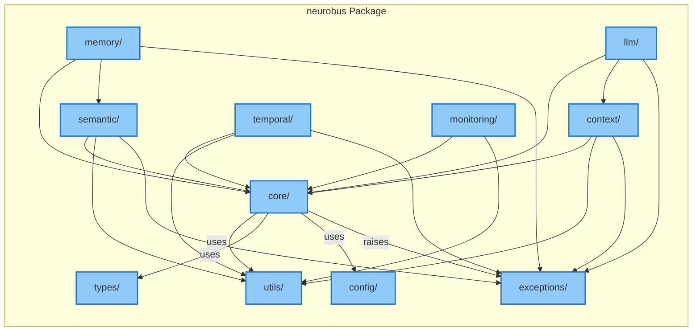

---

## 2. Event Flow

### 2.1 Complete Event Lifecycle

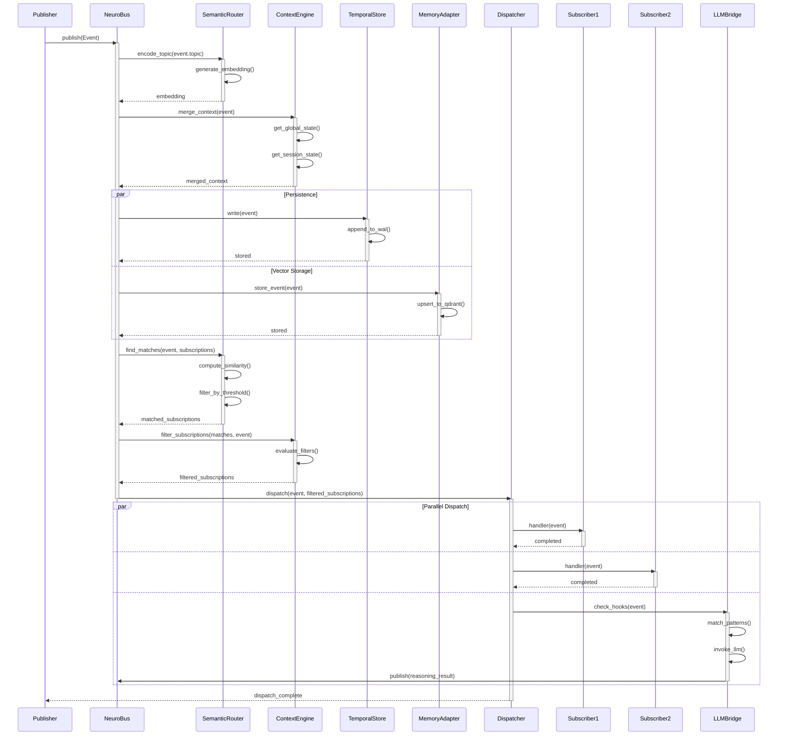

### 2.2 Simple Publish-Subscribe Flow

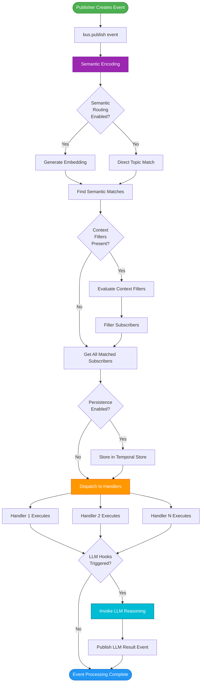

---

## 3. Semantic Routing Process

### 3.1 Semantic Matching Pipeline

```mermaid
flowchart LR
    subgraph "Input"
        EventTopic[Event Topic:<br/>'battery_low']
        Patterns[Subscription Patterns:<br/>- 'low_power'<br/>- 'battery_warning'<br/>- 'system_alert']
    end

    subgraph "Encoding Phase"
        EventTopic --> EventEncoder[Event Encoder]
        Patterns --> PatternEncoder[Pattern Encoder]
        
        EventEncoder --> EventEmbed[Event Embedding<br/>384-dim vector]
        PatternEncoder --> CheckCache{In Cache?}
        
        CheckCache -->|Yes| CachedEmbed[Cached Embeddings]
        CheckCache -->|No| ComputeEmbed[Compute Embeddings]
        ComputeEmbed --> CacheStore[Store in Cache]
        CacheStore --> PatternEmbed[Pattern Embeddings]
        CachedEmbed --> PatternEmbed
    end

    subgraph "Matching Phase"
        EventEmbed --> Similarity[Compute Cosine Similarity]
        PatternEmbed --> Similarity
        
        Similarity --> Scores["Similarity Scores:<br/>low_power: 0.89<br/>battery_warning: 0.82<br/>system_alert: 0.65"]
        
        Scores --> Threshold{Score ≥<br/>Threshold<br/>0.75?}
        
        Threshold -->|Yes| Matched["Matched Patterns:<br/>- low_power ✓<br/>- battery_warning ✓"]
        Threshold -->|No| Rejected["Rejected:<br/>- system_alert ✗"]
    end

    subgraph "Output"
        Matched --> Result[Return Matched<br/>Subscriptions]
    end

    style EventTopic fill:#e1f5ff,stroke:#0288d1
    style Matched fill:#c8e6c9,stroke:#388e3c
    style Rejected fill:#ffcdd2,stroke:#d32f2f
    style Result fill:#fff9c4,stroke:#f9a825
```

### 3.2 Embedding Cache Strategy

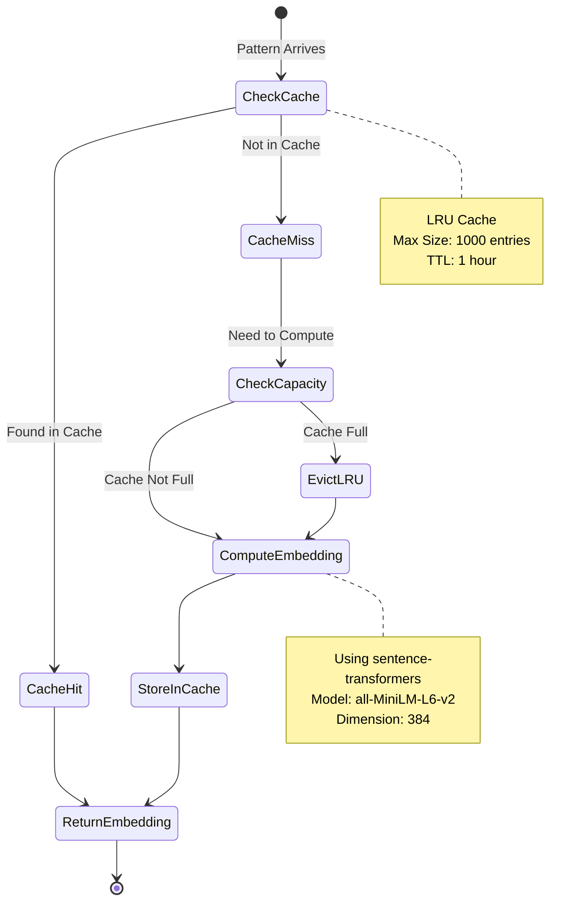

---

## 4. Context Engine Flow

### 4.1 Context Hierarchy and Merging

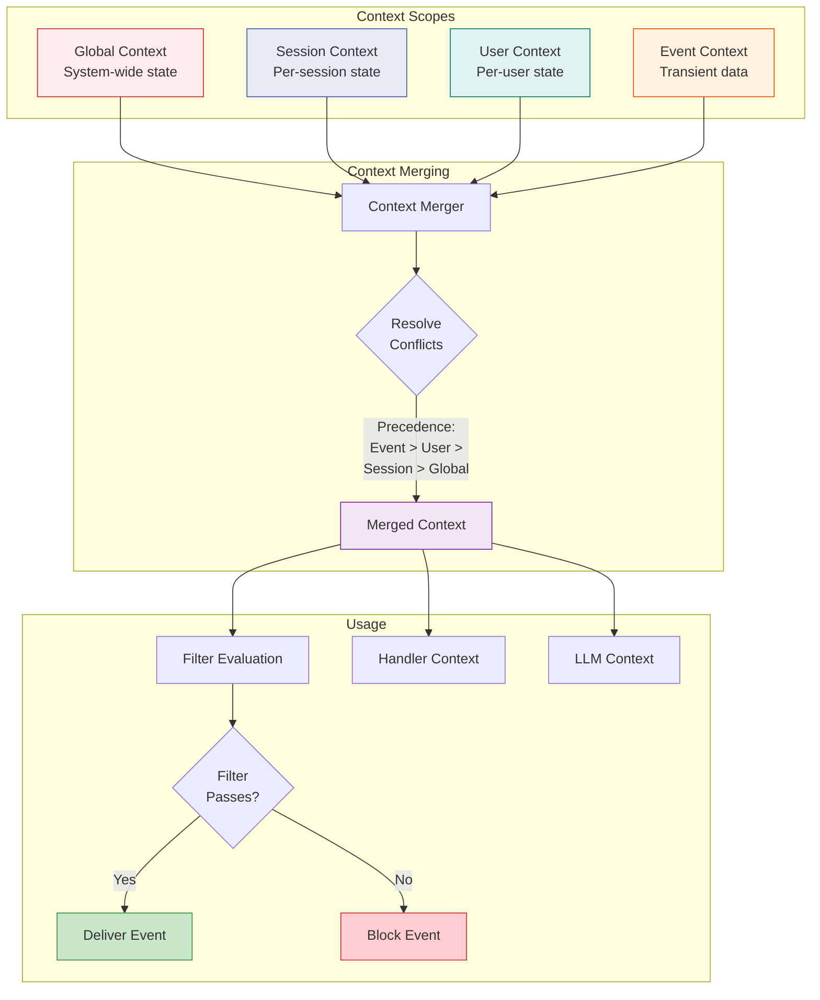

### 4.2 Filter DSL Parsing

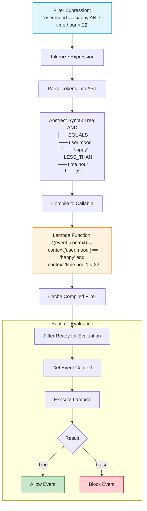

---

## 5. Temporal Store & Replay

### 5.1 Event Persistence Flow

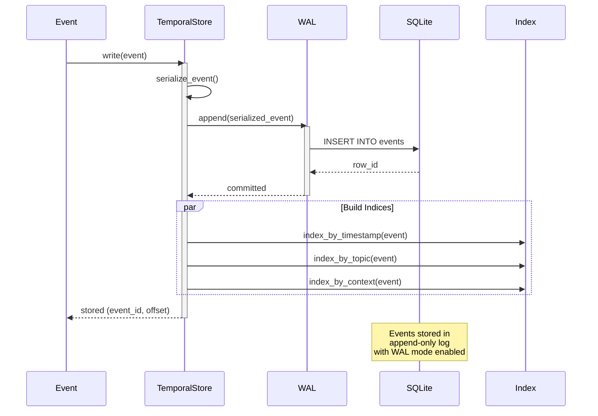

### 5.2 Time-Travel Replay

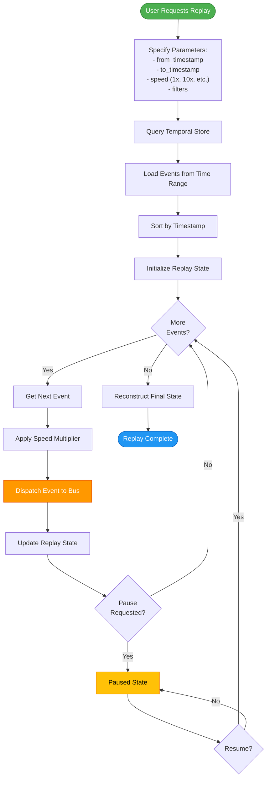

### 5.3 Causality Graph

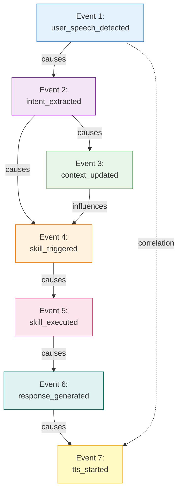

---

## 6. Memory Integration

### 6.1 Memory Storage Pipeline

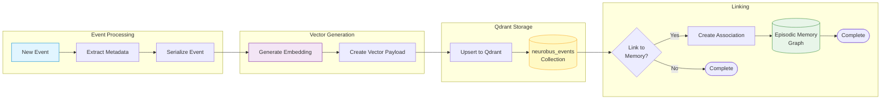

### 6.2 Semantic Search Flow

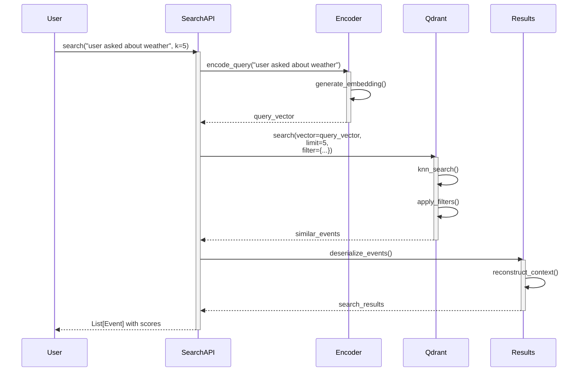

### 6.3 Episodic Memory Linking

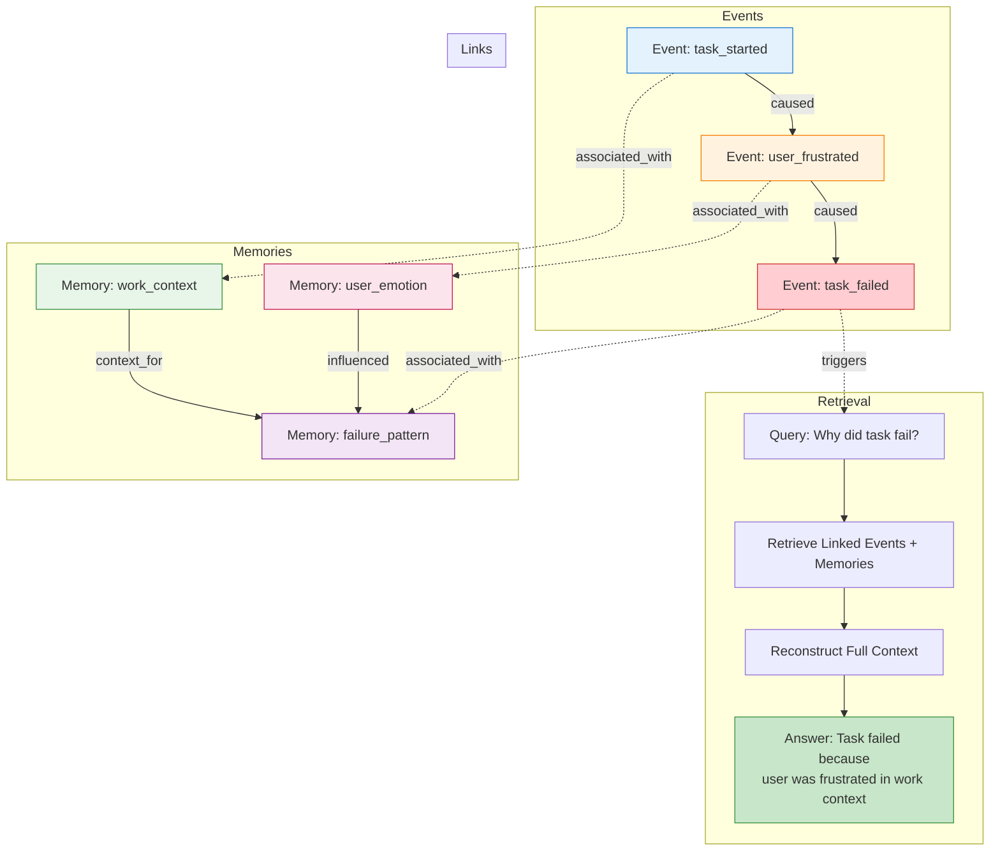

---

## 7. LLM Hook Execution

### 7.1 LLM Hook Trigger Flow

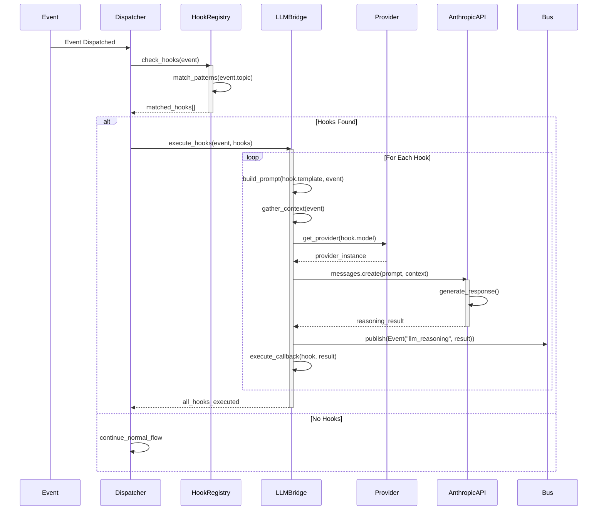

### 7.2 LLM Provider Selection

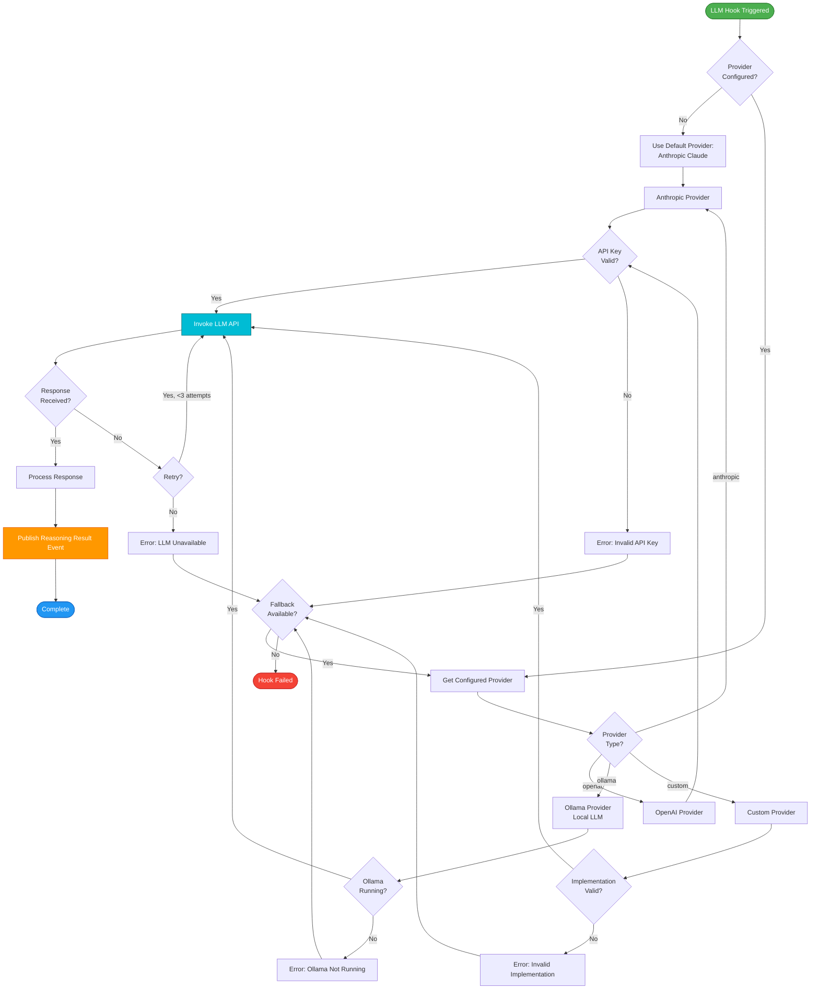

---

## 8. Component Relationships

### 8.1 Core Component Dependencies

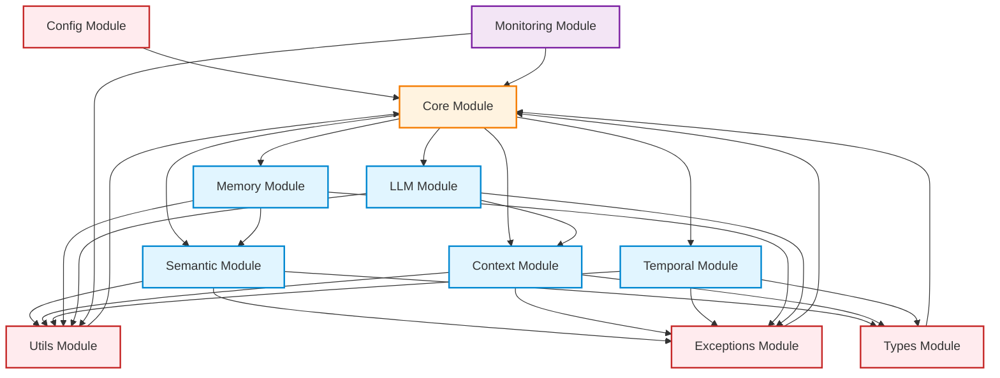

### 8.2 Class Relationships (Core Module)

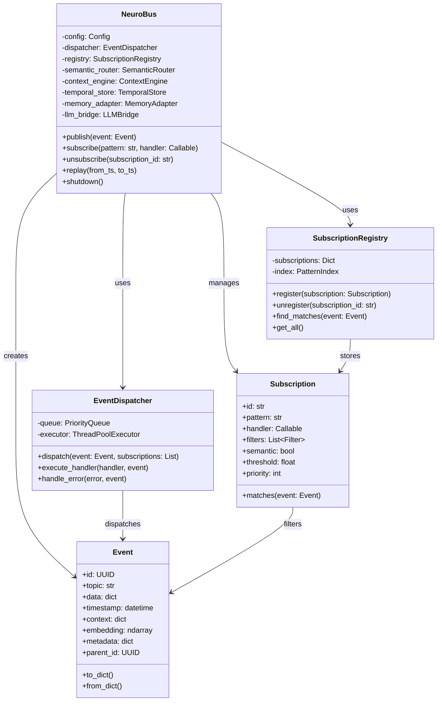

### 8.3 Interface Hierarchy

```mermaid
classDiagram
    class EventBusInterface {
        <<interface>>
        +publish(event)*
        +subscribe(pattern, handler)*
        +unsubscribe(subscription_id)*
    }

    class MemoryAdapterInterface {
        <<interface>>
        +store_event(event)*
        +search_similar(query, k)*
        +link_to_memory(event_id, memory_id)*
    }

    class LLMProviderInterface {
        <<interface>>
        +invoke(prompt, context)*
        +validate_api_key()*
        +get_model_info()*
    }

    class TemporalStoreInterface {
        <<interface>>
        +write(event)*
        +read(event_id)*
        +query(criteria)*
    }

    class NeuroBus {
        +publish(event)
        +subscribe(pattern, handler)
        +unsubscribe(subscription_id)
    }

    class QdrantMemoryAdapter {
        +store_event(event)
        +search_similar(query, k)
        +link_to_memory(event_id, memory_id)
    }

    class LanceDBMemoryAdapter {
        +store_event(event)
        +search_similar(query, k)
        +link_to_memory(event_id, memory_id)
    }

    class AnthropicProvider {
        +invoke(prompt, context)
        +validate_api_key()
        +get_model_info()
    }

    class OpenAIProvider {
        +invoke(prompt, context)
        +validate_api_key()
        +get_model_info()
    }

    class OllamaProvider {
        +invoke(prompt, context)
        +validate_api_key()
        +get_model_info()
    }

    class SQLiteTemporalStore {
        +write(event)
        +read(event_id)
        +query(criteria)
    }

    EventBusInterface <|.. NeuroBus
    MemoryAdapterInterface <|.. QdrantMemoryAdapter
    MemoryAdapterInterface <|.. LanceDBMemoryAdapter
    LLMProviderInterface <|.. AnthropicProvider
    LLMProviderInterface <|.. OpenAIProvider
    LLMProviderInterface <|.. OllamaProvider
    TemporalStoreInterface <|.. SQLiteTemporalStore
```

---

## 9. Data Flow Diagram

### 9.1 Complete Data Flow

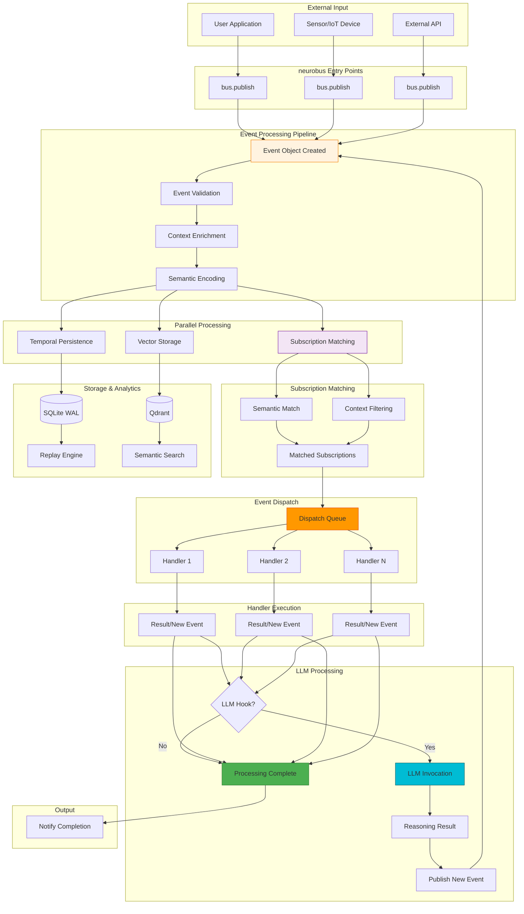

### 9.2 Data Transformation Pipeline

```mermaid
flowchart LR
    Input["Raw Event Data:<br/>{<br/>  topic: 'user_greeting',<br/>  data: {text: 'hello'}<br/>}"]
    
    Input --> Parse[Parse & Validate]
    
    Parse --> EventObj["Event Object:<br/>Event(<br/>  id: UUID,<br/>  topic: 'user_greeting',<br/>  data: {...},<br/>  timestamp: now()<br/>)"]
    
    EventObj --> AddContext["+ Context Merge:<br/>Event(<br/>  ...,<br/>  context: {<br/>    user.mood: 'happy',<br/>    session.id: 'abc'<br/>  }<br/>)"]
    
    AddContext --> Encode["+ Semantic Encoding:<br/>Event(<br/>  ...,<br/>  embedding: [0.12, -0.45, ...]<br/>)"]
    
    Encode --> Serialize["Serialized for Storage:<br/>{<br/>  id: 'uuid-str',<br/>  topic: 'user_greeting',<br/>  data_blob: bytes,<br/>  embedding_blob: bytes,<br/>  timestamp: 1699380000<br/>}"]
    
    Serialize --> Store1[(SQLite)]
    Serialize --> Store2[(Qdrant)]
    
    Encode --> Dispatch["Dispatch Object:<br/>Event (full) +<br/>List[Subscription]"]
    
    Dispatch --> Handler["Handler Receives:<br/>async def handler(event):<br/>  # Access event.data<br/>  # Access event.context"]

    style Input fill:#e1f5ff,stroke:#0288d1
    style EventObj fill:#fff3e0,stroke:#f57c00
    style Encode fill:#f3e5f5,stroke:#7b1fa2
    style Serialize fill:#e8f5e9,stroke:#388e3c
    style Handler fill:#fce4ec,stroke:#c2185b
```

---

## 10. Sequence Diagrams

### 10.1 LUNA Integration Sequence

```mermaid
sequenceDiagram
    participant User
    participant ASR
    participant NeuroBus
    participant NLU
    participant ContextEngine
    participant Skills
    participant TTS

    User->>ASR: Speaks "What's the weather?"
    
    activate ASR
    ASR->>ASR: Speech Recognition
    ASR->>NeuroBus: publish(Event("speech.detected", <br/>data={text: "What's the weather?"}))
    deactivate ASR
    
    activate NeuroBus
    NeuroBus->>NLU: [semantic match] speech_input
    deactivate NeuroBus
    
    activate NLU
    NLU->>NLU: Extract Intent
    NLU->>NeuroBus: publish(Event("intent.extracted",<br/>data={intent: "weather_query"}))
    deactivate NLU
    
    activate NeuroBus
    NeuroBus->>ContextEngine: merge_context(event)
    activate ContextEngine
    ContextEngine->>ContextEngine: Add user.location
    ContextEngine-->>NeuroBus: enriched_event
    deactivate ContextEngine
    
    NeuroBus->>Skills: [semantic match] weather_request
    deactivate NeuroBus
    
    activate Skills
    Skills->>Skills: Get Weather Data
    Skills->>NeuroBus: publish(Event("skill.executed",<br/>data={weather: {...}}))
    deactivate Skills
    
    activate NeuroBus
    NeuroBus->>TTS: [semantic match] speak_result
    deactivate NeuroBus
    
    activate TTS
    TTS->>TTS: Generate Speech
    TTS->>User: Speaks Weather Info
    deactivate TTS
```

### 10.2 Multi-Agent Communication

```mermaid
sequenceDiagram
    participant Agent1
    participant NeuroBus
    participant SemanticRouter
    participant Agent2
    participant Agent3

    Agent1->>NeuroBus: publish(Event("task.discovered",<br/>data={task: "analyze_data"}))
    
    activate NeuroBus
    NeuroBus->>SemanticRouter: find_matches("task.discovered")
    
    activate SemanticRouter
    SemanticRouter->>SemanticRouter: Encode "task.discovered"
    SemanticRouter->>SemanticRouter: Match against:<br/>- "work.available" (Agent2)<br/>- "job.pending" (Agent3)
    SemanticRouter-->>NeuroBus: matches: [Agent2, Agent3]
    deactivate SemanticRouter
    
    par Notify Both Agents
        NeuroBus->>Agent2: task_available(event)
        NeuroBus->>Agent3: task_available(event)
    end
    deactivate NeuroBus
    
    activate Agent2
    Agent2->>Agent2: Check Capacity
    Agent2->>NeuroBus: publish(Event("task.accepted",<br/>data={agent: "Agent2"}))
    deactivate Agent2
    
    activate Agent3
    Agent3->>Agent3: Check Capacity
    Agent3->>NeuroBus: publish(Event("task.declined",<br/>data={agent: "Agent3"}))
    deactivate Agent3
    
    activate NeuroBus
    NeuroBus->>Agent1: task_accepted(event)
    deactivate NeuroBus
    
    activate Agent1
    Agent1->>Agent2: Assign Task Details
    deactivate Agent1
```

### 10.3 Error Recovery Flow

```mermaid
sequenceDiagram
    participant Module
    participant NeuroBus
    participant ErrorHandler
    participant TemporalStore
    participant LLMBridge
    participant Admin

    Module->>NeuroBus: publish(Event("task.execute"))
    
    activate NeuroBus
    NeuroBus->>Module: dispatch to handler
    deactivate NeuroBus
    
    activate Module
    Module->>Module: Execute Task
    Module--xModule: Exception Raised
    Module->>NeuroBus: publish(Event("task.failed",<br/>data={error: "..."}))
    deactivate Module
    
    activate NeuroBus
    NeuroBus->>TemporalStore: Store error event
    NeuroBus->>ErrorHandler: [match] error_occurred
    NeuroBus->>LLMBridge: [hook] analyze_error
    deactivate NeuroBus
    
    activate ErrorHandler
    ErrorHandler->>ErrorHandler: Log Error
    ErrorHandler->>ErrorHandler: Check Retry Policy
    ErrorHandler->>NeuroBus: publish(Event("task.retry"))
    deactivate ErrorHandler
    
    activate LLMBridge
    LLMBridge->>LLMBridge: Build Analysis Prompt
    LLMBridge->>LLMBridge: Call LLM API
    LLMBridge->>NeuroBus: publish(Event("error.analysis",<br/>data={diagnosis: "..."}))
    deactivate LLMBridge
    
    activate NeuroBus
    NeuroBus->>Admin: [match] critical_error
    deactivate NeuroBus
    
    activate Admin
    Admin->>Admin: Review Analysis
    Admin->>NeuroBus: publish(Event("error.resolved"))
    deactivate Admin
```

---

## 11. State Diagrams

### 11.1 Event Lifecycle States

```mermaid
stateDiagram-v2
    [*] --> Created: Event Created
    
    Created --> Validating: Validate Schema
    
    Validating --> Enriching: Valid
    Validating --> Failed: Invalid
    
    Enriching --> Encoding: Add Context
    
    Encoding --> Persisting: Generate Embedding
    
    Persisting --> Matching: Store Complete
    
    Matching --> Dispatching: Subscriptions Found
    Matching --> Completed: No Subscriptions
    
    Dispatching --> Executing: Queue Handlers
    
    Executing --> Executing: More Handlers
    Executing --> LLMHook: Check Hooks
    
    LLMHook --> Completed: No Hooks
    LLMHook --> LLMProcessing: Hooks Found
    
    LLMProcessing --> Completed: LLM Done
    
    Completed --> [*]
    Failed --> [*]
    
    note right of Created
        Event object instantiated
        ID assigned
    end note
    
    note right of Persisting
        Stored in:
        - SQLite (temporal)
        - Qdrant (vector)
    end note
    
    note right of Executing
        Handlers run in parallel
        Errors isolated
    end note
```

### 11.2 Subscription Lifecycle

```mermaid
stateDiagram-v2
    [*] --> Registering: subscribe() called
    
    Registering --> Validating: Check Handler
    
    Validating --> Indexing: Valid Handler
    Validating --> Error: Invalid Handler
    
    Indexing --> Active: Add to Registry
    
    Active --> Matching: Event Published
    
    Matching --> Active: No Match
    Matching --> Filtering: Semantic Match
    
    Filtering --> Active: Filter Failed
    Filtering --> Executing: Filter Passed
    
    Executing --> Active: Execution Complete
    Executing --> ErrorState: Execution Failed
    
    ErrorState --> Active: Retry
    ErrorState --> Suspended: Max Retries
    
    Active --> Unregistering: unsubscribe() called
    Suspended --> Unregistering: Remove Subscription
    
    Unregistering --> Cleanup: Remove from Registry
    Cleanup --> [*]
    
    Error --> [*]
    
    note right of Active
        Subscription is live
        Waiting for events
    end note
    
    note right of Suspended
        Temporarily disabled
        Due to repeated failures
    end note
```

### 11.3 Bus Lifecycle

```mermaid
stateDiagram-v2
    [*] --> Initializing: NeuroBus()
    
    Initializing --> LoadingConfig: Load Configuration
    
    LoadingConfig --> InitializingComponents: Config Loaded
    LoadingConfig --> Error: Config Invalid
    
    InitializingComponents --> LoadingModels: Create Components
    
    LoadingModels --> Starting: Load ML Models
    
    Starting --> Ready: Startup Hooks Complete
    
    Ready --> Processing: Events Being Handled
    
    Processing --> Ready: Idle
    Processing --> Processing: Active
    
    Ready --> ShuttingDown: shutdown() called
    Processing --> ShuttingDown: shutdown() called
    
    ShuttingDown --> DrainingQueue: Stop Accepting Events
    
    DrainingQueue --> CleanupComponents: Queue Empty
    
    CleanupComponents --> Stopped: Cleanup Complete
    
    Stopped --> [*]
    Error --> [*]
    
    note right of Ready
        Bus operational
        Accepting events
        All systems active
    end note
    
    note right of DrainingQueue
        Graceful shutdown
        Processing remaining events
        No new events accepted
    end note
```

---

## 12. Deployment Architecture

### 12.1 Standalone Deployment

```mermaid
graph TB
    subgraph "Host Machine"
        subgraph "Application Process"
            App[Python Application]
            NeuroBus[neurobus Library]
            App --> NeuroBus
        end
        
        subgraph "Local Services"
            SQLite[(SQLite<br/>Temporal Store)]
            SentenceTransformer[Sentence Transformers<br/>Model Cache]
        end
        
        NeuroBus --> SQLite
        NeuroBus --> SentenceTransformer
    end
    
    subgraph "External Services"
        Qdrant[Qdrant Cloud<br/>Vector Store]
        Anthropic[Anthropic API<br/>Claude]
    end
    
    NeuroBus -.->|Optional| Qdrant
    NeuroBus -.->|Optional| Anthropic

    style App fill:#e1f5ff,stroke:#0288d1
    style NeuroBus fill:#fff3e0,stroke:#f57c00
    style SQLite fill:#e8f5e9,stroke:#388e3c
    style Qdrant fill:#f3e5f5,stroke:#7b1fa2
    style Anthropic fill:#fce4ec,stroke:#c2185b
```

### 12.2 Docker Deployment

```mermaid
graph TB
    subgraph "Docker Host"
        subgraph "neurobus Container"
            App[Application]
            Bus[neurobus]
            App --> Bus
        end
        
        subgraph "Qdrant Container"
            QdrantServer[Qdrant Server]
            QdrantData[(Vector Data)]
            QdrantServer --> QdrantData
        end
        
        subgraph "Volumes"
            EventsDB[(events.db)]
            ModelsCache[(models/)]
        end
        
        Bus --> EventsDB
        Bus --> ModelsCache
        Bus --> QdrantServer
    end
    
    subgraph "External"
        AnthropicAPI[Anthropic API]
    end
    
    Bus -.-> AnthropicAPI
    
    DockerNetwork[Docker Network: neurobus-net]
    
    Bus -.- DockerNetwork
    QdrantServer -.- DockerNetwork

    style App fill:#e1f5ff,stroke:#0288d1
    style Bus fill:#fff3e0,stroke:#f57c00
    style QdrantServer fill:#f3e5f5,stroke:#7b1fa2
    style DockerNetwork fill:#e8f5e9,stroke:#388e3c
```

### 12.3 Kubernetes Deployment

```mermaid
graph TB
    subgraph "Kubernetes Cluster"
        subgraph "neurobus Namespace"
            subgraph "Application Deployment"
                Pod1[App Pod 1<br/>neurobus]
                Pod2[App Pod 2<br/>neurobus]
                Pod3[App Pod 3<br/>neurobus]
            end
            
            subgraph "Qdrant StatefulSet"
                QdrantPod1[Qdrant Pod 1]
                QdrantPod2[Qdrant Pod 2]
            end
            
            subgraph "Storage"
                PVC1[PVC: events-db]
                PVC2[PVC: qdrant-data]
                PVC3[PVC: models-cache]
            end
            
            Service[Service:<br/>neurobus-svc]
            QdrantService[Service:<br/>qdrant-svc]
            
            ConfigMap[ConfigMap:<br/>neurobus-config]
            Secret[Secret:<br/>api-keys]
        end
        
        subgraph "Monitoring"
            Prometheus[Prometheus]
            Grafana[Grafana]
        end
        
        Ingress[Ingress Controller]
    end
    
    Pod1 --> PVC1
    Pod2 --> PVC1
    Pod3 --> PVC1
    
    Pod1 --> PVC3
    Pod2 --> PVC3
    Pod3 --> PVC3
    
    QdrantPod1 --> PVC2
    QdrantPod2 --> PVC2
    
    Pod1 --> ConfigMap
    Pod2 --> ConfigMap
    Pod3 --> ConfigMap
    
    Pod1 --> Secret
    Pod2 --> Secret
    Pod3 --> Secret
    
    Service --> Pod1
    Service --> Pod2
    Service --> Pod3
    
    QdrantService --> QdrantPod1
    QdrantService --> QdrantPod2
    
    Pod1 -.->|metrics| Prometheus
    Pod2 -.->|metrics| Prometheus
    Pod3 -.->|metrics| Prometheus
    
    Prometheus --> Grafana
    
    Ingress --> Service
    
    External[External Traffic] --> Ingress

    style Pod1 fill:#e1f5ff,stroke:#0288d1
    style Pod2 fill:#e1f5ff,stroke:#0288d1
    style Pod3 fill:#e1f5ff,stroke:#0288d1
    style QdrantPod1 fill:#f3e5f5,stroke:#7b1fa2
    style QdrantPod2 fill:#f3e5f5,stroke:#7b1fa2
    style Prometheus fill:#fff3e0,stroke:#f57c00
    style Grafana fill:#e8f5e9,stroke:#388e3c
```

### 12.4 Distributed Architecture (Future)

```mermaid
graph TB
    subgraph "Region 1"
        Bus1[neurobus Node 1]
        Local1[(Local Storage)]
        Cache1[Local Cache]
        
        Bus1 --> Local1
        Bus1 --> Cache1
    end
    
    subgraph "Region 2"
        Bus2[neurobus Node 2]
        Local2[(Local Storage)]
        Cache2[Local Cache]
        
        Bus2 --> Local2
        Bus2 --> Cache2
    end
    
    subgraph "Region 3"
        Bus3[neurobus Node 3]
        Local3[(Local Storage)]
        Cache3[Local Cache]
        
        Bus3 --> Local3
        Bus3 --> Cache3
    end
    
    subgraph "Shared Services"
        GlobalQdrant[(Global Qdrant<br/>Vector Store)]
        EventSync[Event Sync Service]
        ConfigServer[Config Server]
    end
    
    subgraph "Coordination"
        Federation[Federation Layer]
        Discovery[Service Discovery]
        LoadBalancer[Load Balancer]
    end
    
    Bus1 <-.->|gRPC| EventSync
    Bus2 <-.->|gRPC| EventSync
    Bus3 <-.->|gRPC| EventSync
    
    Bus1 --> GlobalQdrant
    Bus2 --> GlobalQdrant
    Bus3 --> GlobalQdrant
    
    Federation --> Bus1
    Federation --> Bus2
    Federation --> Bus3
    
    Discovery --> Bus1
    Discovery --> Bus2
    Discovery --> Bus3
    
    LoadBalancer --> Federation
    
    ConfigServer --> Bus1
    ConfigServer --> Bus2
    ConfigServer --> Bus3
    
    Clients[Clients] --> LoadBalancer

    style Bus1 fill:#e1f5ff,stroke:#0288d1
    style Bus2 fill:#e1f5ff,stroke:#0288d1
    style Bus3 fill:#e1f5ff,stroke:#0288d1
    style Federation fill:#fff3e0,stroke:#f57c00
    style GlobalQdrant fill:#f3e5f5,stroke:#7b1fa2
    style EventSync fill:#e8f5e9,stroke:#388e3c
```

---

## 13. Performance & Scalability

### 13.1 Event Processing Throughput

```mermaid
graph LR
    subgraph "Input Queue"
        E1[Event 1]
        E2[Event 2]
        E3[Event 3]
        EN[Event N]
    end
    
    subgraph "Processing Pipeline"
        subgraph "Stage 1: Validation"
            V1[Validator 1]
            V2[Validator 2]
        end
        
        subgraph "Stage 2: Encoding"
            Enc1[Encoder 1]
            Enc2[Encoder 2]
            Enc3[Encoder 3]
        end
        
        subgraph "Stage 3: Matching"
            M1[Matcher 1]
            M2[Matcher 2]
            M3[Matcher 3]
            M4[Matcher 4]
        end
        
        subgraph "Stage 4: Dispatch"
            D1[Dispatcher 1]
            D2[Dispatcher 2]
            D3[Dispatcher 3]
            D4[Dispatcher 4]
            D5[Dispatcher 5]
        end
    end
    
    E1 --> V1
    E2 --> V1
    E3 --> V2
    EN --> V2
    
    V1 --> Enc1
    V1 --> Enc2
    V2 --> Enc2
    V2 --> Enc3
    
    Enc1 --> M1
    Enc1 --> M2
    Enc2 --> M2
    Enc2 --> M3
    Enc3 --> M3
    Enc3 --> M4
    
    M1 --> D1
    M1 --> D2
    M2 --> D2
    M2 --> D3
    M3 --> D3
    M3 --> D4
    M4 --> D4
    M4 --> D5
    
    subgraph "Output"
        D1 --> H[Handlers]
        D2 --> H
        D3 --> H
        D4 --> H
        D5 --> H
    end
    
    subgraph "Metrics"
        H -.->|10K events/sec| Throughput[Target Throughput]
        H -.->|<2ms P95| Latency[Target Latency]
    end

    style E1 fill:#e1f5ff,stroke:#0288d1
    style H fill:#c8e6c9,stroke:#388e3c
    style Throughput fill:#fff9c4,stroke:#f9a825
    style Latency fill:#fff9c4,stroke:#f9a825
```

### 13.2 Caching Strategy

```mermaid
graph TD
    Request[Embedding Request] --> L1{L1 Cache<br/>In-Memory?}
    
    L1 -->|Hit| Return1[Return Embedding]
    L1 -->|Miss| L2{L2 Cache<br/>Redis?}
    
    L2 -->|Hit| StoreL1[Store in L1]
    StoreL1 --> Return2[Return Embedding]
    
    L2 -->|Miss| Compute[Compute Embedding]
    Compute --> StoreL2[Store in L2]
    StoreL2 --> StoreL1
    
    subgraph "Cache Stats"
        Return1 -.->|<0.1ms| FastPath[Fast Path]
        Return2 -.->|<1ms| MediumPath[Medium Path]
        StoreL1 -.->|3-5ms| SlowPath[Slow Path]
    end
    
    subgraph "Cache Eviction"
        L1 --> LRU1[LRU Eviction<br/>Max: 1000 entries]
        L2 --> LRU2[LRU Eviction<br/>Max: 10000 entries]
    end

    style Return1 fill:#c8e6c9,stroke:#388e3c
    style Return2 fill:#fff9c4,stroke:#f9a825
    style Compute fill:#ffcdd2,stroke:#d32f2f
```

---

## 14. Testing Strategy

### 14.1 Test Pyramid

```mermaid
graph TD
    subgraph "Test Pyramid"
        E2E[End-to-End Tests<br/>10%<br/>Full workflow tests]
        Integration[Integration Tests<br/>20%<br/>Component interaction]
        Unit[Unit Tests<br/>70%<br/>Individual functions]
    end
    
    Unit --> Integration
    Integration --> E2E
    
    subgraph "Test Coverage Goals"
        Unit -.->|>90%| UC[Unit Coverage]
        Integration -.->|>80%| IC[Integration Coverage]
        E2E -.->|Critical Paths| EC[E2E Coverage]
    end

    style Unit fill:#c8e6c9,stroke:#388e3c
    style Integration fill:#fff9c4,stroke:#f9a825
    style E2E fill:#ffcdd2,stroke:#d32f2f
```

### 14.2 CI/CD Pipeline

```mermaid
flowchart LR
    subgraph "Development"
        Code[Code Changes]
        Commit[Git Commit]
        Push[Git Push]
    end
    
    subgraph "CI Pipeline"
        Trigger[GitHub Actions Trigger]
        
        subgraph "Build Stage"
            Install[Install Dependencies]
            Lint[Linting<br/>black, ruff, mypy]
            TypeCheck[Type Checking]
        end
        
        subgraph "Test Stage"
            UnitTests[Unit Tests<br/>pytest]
            IntegrationTests[Integration Tests]
            PerfTests[Performance Tests]
        end
        
        subgraph "Quality Stage"
            Coverage[Coverage Report<br/>>90% required]
            Security[Security Scan<br/>bandit, safety]
        end
    end
    
    subgraph "CD Pipeline"
        BuildPackage[Build Package]
        BuildDocs[Build Docs]
        
        subgraph "Release"
            TestPyPI[Test PyPI]
            PyPI[PyPI Release]
            DocsDeploy[Deploy Docs]
            GitHubRelease[GitHub Release]
        end
    end
    
    Code --> Commit
    Commit --> Push
    Push --> Trigger
    
    Trigger --> Install
    Install --> Lint
    Lint --> TypeCheck
    TypeCheck --> UnitTests
    UnitTests --> IntegrationTests
    IntegrationTests --> PerfTests
    PerfTests --> Coverage
    Coverage --> Security
    
    Security --> BuildPackage
    BuildPackage --> BuildDocs
    BuildDocs --> TestPyPI
    TestPyPI --> PyPI
    PyPI --> DocsDeploy
    DocsDeploy --> GitHubRelease
    
    style Code fill:#e1f5ff,stroke:#0288d1
    style UnitTests fill:#c8e6c9,stroke:#388e3c
    style Coverage fill:#fff9c4,stroke:#f9a825
    style PyPI fill:#f3e5f5,stroke:#7b1fa2
```

---

## 15. Monitoring & Observability

### 15.1 Metrics Collection

```mermaid
graph TB
    subgraph "neurobus Application"
        Core[Core Module]
        Semantic[Semantic Module]
        Temporal[Temporal Module]
        
        Core --> MetricsCollector[Metrics Collector]
        Semantic --> MetricsCollector
        Temporal --> MetricsCollector
    end
    
    subgraph "Metrics Types"
        MetricsCollector --> Counters[Counters<br/>- events_published<br/>- events_dispatched<br/>- subscriptions_active]
        MetricsCollector --> Gauges[Gauges<br/>- queue_depth<br/>- active_handlers<br/>- memory_usage]
        MetricsCollector --> Histograms[Histograms<br/>- dispatch_latency<br/>- handler_duration<br/>- embedding_time]
    end
    
    subgraph "Exporters"
        Counters --> Prometheus[Prometheus Exporter]
        Gauges --> Prometheus
        Histograms --> Prometheus
        
        Prometheus --> PrometheusServer[(Prometheus Server)]
    end
    
    subgraph "Visualization"
        PrometheusServer --> Grafana[Grafana Dashboard]
        Grafana --> Dashboard1[Events Dashboard]
        Grafana --> Dashboard2[Performance Dashboard]
        Grafana --> Dashboard3[Health Dashboard]
    end
    
    subgraph "Alerting"
        PrometheusServer --> AlertManager[Alert Manager]
        AlertManager --> Slack[Slack Notifications]
        AlertManager --> Email[Email Alerts]
        AlertManager --> PagerDuty[PagerDuty]
    end

    style Core fill:#fff3e0,stroke:#f57c00
    style Prometheus fill:#e8f5e9,stroke:#388e3c
    style Grafana fill:#e1f5ff,stroke:#0288d1
    style AlertManager fill:#ffcdd2,stroke:#d32f2f
```

### 15.2 Distributed Tracing

```mermaid
sequenceDiagram
    participant Client
    participant Bus
    participant Semantic
    participant Context
    participant Dispatcher
    participant Handler
    
    Note over Client,Handler: Trace ID: abc-123-def
    
    Client->>Bus: publish(event)
    activate Bus
    Note right of Bus: Span: event.publish<br/>Duration: 0.5ms
    
    Bus->>Semantic: encode(topic)
    activate Semantic
    Note right of Semantic: Span: semantic.encode<br/>Duration: 3.2ms
    Semantic-->>Bus: embedding
    deactivate Semantic
    
    Bus->>Context: merge_context(event)
    activate Context
    Note right of Context: Span: context.merge<br/>Duration: 0.8ms
    Context-->>Bus: context
    deactivate Context
    
    Bus->>Dispatcher: dispatch(event)
    deactivate Bus
    
    activate Dispatcher
    Note right of Dispatcher: Span: event.dispatch<br/>Duration: 1.2ms
    
    Dispatcher->>Handler: handler(event)
    activate Handler
    Note right of Handler: Span: handler.execute<br/>Duration: 15ms
    Handler-->>Dispatcher: result
    deactivate Handler
    
    Dispatcher-->>Client: complete
    deactivate Dispatcher
    
    Note over Client,Handler: Total Duration: 20.7ms<br/>Trace complete
```

### 15.3 Health Check System

```mermaid
stateDiagram-v2
    [*] --> Healthy: System Start
    
    Healthy --> Degraded: Warning Threshold
    Healthy --> Healthy: All Checks Pass
    
    Degraded --> Healthy: Recovery
    Degraded --> Unhealthy: Error Threshold
    Degraded --> Degraded: Some Checks Fail
    
    Unhealthy --> Degraded: Partial Recovery
    Unhealthy --> Unhealthy: Critical Failures
    Unhealthy --> [*]: Shutdown Required
    
    note right of Healthy
        All systems operational:
        - Event latency < 2ms
        - Queue depth < 1000
        - Memory < 80%
        - All dependencies up
    end note
    
    note right of Degraded
        Some issues detected:
        - Latency 2-5ms
        - Queue depth 1000-5000
        - Memory 80-90%
        - Some dependencies slow
    end note
    
    note right of Unhealthy
        Critical problems:
        - Latency > 5ms
        - Queue depth > 5000
        - Memory > 90%
        - Dependencies down
    end note
```

---

## 16. Security Architecture

### 16.1 Security Layers

```mermaid
graph TB
    subgraph "Application Layer Security"
        InputValidation[Input Validation<br/>Schema enforcement]
        RateLimiting[Rate Limiting<br/>Per-subscriber quotas]
        AccessControl[Access Control<br/>Permission-based subs]
    end
    
    subgraph "Transport Layer Security"
        TLS[TLS Encryption<br/>External connections]
        Authentication[API Authentication<br/>Token-based]
    end
    
    subgraph "Data Layer Security"
        EncryptionAtRest[Encryption at Rest<br/>Sensitive event data]
        DataMinimization[Data Minimization<br/>Store only necessary]
        PIIRedaction[PII Redaction<br/>Configurable filters]
    end
    
    subgraph "Infrastructure Security"
        NetworkPolicy[Network Policies<br/>K8s isolation]
        SecretManagement[Secret Management<br/>API keys, tokens]
        AuditLogging[Audit Logging<br/>Security events]
    end
    
    InputValidation --> RateLimiting
    RateLimiting --> AccessControl
    AccessControl --> TLS
    TLS --> Authentication
    Authentication --> EncryptionAtRest
    EncryptionAtRest --> DataMinimization
    DataMinimization --> PIIRedaction
    PIIRedaction --> NetworkPolicy
    NetworkPolicy --> SecretManagement
    SecretManagement --> AuditLogging

    style InputValidation fill:#c8e6c9,stroke:#388e3c
    style TLS fill:#e1f5ff,stroke:#0288d1
    style EncryptionAtRest fill:#fff9c4,stroke:#f9a825
    style AuditLogging fill:#f3e5f5,stroke:#7b1fa2
```

### 16.2 Authentication Flow

```mermaid
sequenceDiagram
    participant Client
    participant Gateway
    participant NeuroBus
    participant AuthService
    participant TokenStore
    
    Client->>Gateway: Request with API Key
    
    activate Gateway
    Gateway->>AuthService: Validate API Key
    
    activate AuthService
    AuthService->>TokenStore: Check Token
    
    alt Valid Token
        TokenStore-->>AuthService: Token Valid
        AuthService-->>Gateway: Authenticated
        Gateway->>NeuroBus: Forward Request
        
        activate NeuroBus
        NeuroBus->>NeuroBus: Process Event
        NeuroBus-->>Gateway: Response
        deactivate NeuroBus
        
        Gateway-->>Client: Success
    else Invalid Token
        TokenStore-->>AuthService: Token Invalid
        AuthService-->>Gateway: Authentication Failed
        Gateway-->>Client: 401 Unauthorized
    end
    
    deactivate AuthService
    deactivate Gateway
```

---

## 17. Development Workflow

### 17.1 Feature Development Flow

```mermaid
flowchart TD
    Start([New Feature Request]) --> Issue[Create GitHub Issue]
    
    Issue --> Branch[Create Feature Branch<br/>feature/semantic-improvements]
    
    Branch --> Develop[Write Code]
    
    Develop --> LocalTest[Run Local Tests<br/>pytest]
    
    LocalTest --> Pass1{Tests Pass?}
    Pass1 -->|No| Debug[Debug & Fix]
    Debug --> Develop
    Pass1 -->|Yes| Lint[Run Linters<br/>black, ruff]
    
    Lint --> Pass2{Lint Pass?}
    Pass2 -->|No| Fix[Fix Lint Issues]
    Fix --> Lint
    Pass2 -->|Yes| Commit[Git Commit]
    
    Commit --> Push[Push to GitHub]
    
    Push --> CI[CI Pipeline Runs]
    
    CI --> Pass3{CI Pass?}
    Pass3 -->|No| ReviewCI[Review CI Failures]
    ReviewCI --> Develop
    Pass3 -->|Yes| PR[Create Pull Request]
    
    PR --> CodeReview[Code Review]
    
    CodeReview --> Changes{Changes<br/>Requested?}
    Changes -->|Yes| Develop
    Changes -->|No| Approve[PR Approved]
    
    Approve --> Merge[Merge to Main]
    
    Merge --> Deploy[Deploy to Staging]
    
    Deploy --> Validate[Validate on Staging]
    
    Validate --> Success{Validation<br/>Success?}
    Success -->|No| Rollback[Rollback]
    Rollback --> Develop
    Success -->|Yes| Production[Deploy to Production]
    
    Production --> Monitor[Monitor Metrics]
    
    Monitor --> Done([Feature Complete])

    style Start fill:#4caf50,stroke:#2e7d32,color:#fff
    style CI fill:#ff9800,stroke:#e65100,color:#fff
    style Approve fill:#c8e6c9,stroke:#388e3c
    style Done fill:#2196f3,stroke:#1565c0,color:#fff
```

### 17.2 Release Process

```mermaid
flowchart LR
    subgraph "Pre-Release"
        Version[Bump Version]
        Changelog[Update CHANGELOG.md]
        Docs[Update Documentation]
    end
    
    subgraph "Build"
        BuildPkg[Build Package<br/>poetry build]
        BuildDocs[Build Docs<br/>sphinx-build]
        RunTests[Run Full Test Suite]
    end
    
    subgraph "Validation"
        TestPyPI[Upload to Test PyPI]
        TestInstall[Test Installation]
        TestImport[Test Import]
    end
    
    subgraph "Release"
        Tag[Create Git Tag<br/>v1.0.0]
        PyPI[Upload to PyPI]
        GHRelease[Create GitHub Release]
        DeployDocs[Deploy Documentation]
    end
    
    subgraph "Post-Release"
        Announce[Announce Release<br/>Discord, Twitter]
        Monitor[Monitor Metrics]
        Support[Community Support]
    end
    
    Version --> Changelog
    Changelog --> Docs
    Docs --> BuildPkg
    BuildPkg --> BuildDocs
    BuildDocs --> RunTests
    RunTests --> TestPyPI
    TestPyPI --> TestInstall
    TestInstall --> TestImport
    TestImport --> Tag
    Tag --> PyPI
    PyPI --> GHRelease
    GHRelease --> DeployDocs
    DeployDocs --> Announce
    Announce --> Monitor
    Monitor --> Support

    style Version fill:#e1f5ff,stroke:#0288d1
    style TestPyPI fill:#fff9c4,stroke:#f9a825
    style PyPI fill:#c8e6c9,stroke:#388e3c
    style Announce fill:#f3e5f5,stroke:#7b1fa2
```

---

## 18. Integration Patterns

### 18.1 LUNA Integration Pattern

```mermaid
graph LR
    subgraph "LUNA Components"
        ASR[ASR Module]
        NLU[NLU Module]
        Skills[Skills Engine]
        Memory[Memory System]
        TTS[TTS Module]
    end
    
    subgraph "neurobus Core"
        Bus[Event Bus]
        
        subgraph "Topics"
            T1[speech.*]
            T2[intent.*]
            T3[skill.*]
            T4[memory.*]
            T5[response.*]
        end
    end
    
    ASR -->|publish| T1
    T1 -->|subscribe| NLU
    
    NLU -->|publish| T2
    T2 -->|subscribe| Skills
    T2 -->|subscribe| Memory
    
    Skills -->|publish| T3
    T3 -->|subscribe| TTS
    T3 -->|subscribe| Memory
    
    Memory -->|publish| T4
    T4 -->|subscribe| Skills
    
    TTS -->|publish| T5

    style Bus fill:#fff3e0,stroke:#f57c00
    style ASR fill:#e1f5ff,stroke:#0288d1
    style NLU fill:#f3e5f5,stroke:#7b1fa2
    style Skills fill:#e8f5e9,stroke:#388e3c
    style Memory fill:#fce4ec,stroke:#c2185b
    style TTS fill:#fff9c4,stroke:#f9a825
```

### 18.2 Microservices Integration

```mermaid
graph TD
    subgraph "Service A"
        A[Business Logic A]
        BusA[neurobus Instance A]
        A --> BusA
    end
    
    subgraph "Service B"
        B[Business Logic B]
        BusB[neurobus Instance B]
        B --> BusB
    end
    
    subgraph "Service C"
        C[Business Logic C]
        BusC[neurobus Instance C]
        C --> BusC
    end
    
    subgraph "Shared Infrastructure"
        SharedQdrant[(Shared Qdrant)]
        MessageBroker[Message Broker<br/>RabbitMQ/Kafka]
    end
    
    BusA --> SharedQdrant
    BusB --> SharedQdrant
    BusC --> SharedQdrant
    
    BusA <-.->|cross-service events| MessageBroker
    BusB <-.->|cross-service events| MessageBroker
    BusC <-.->|cross-service events| MessageBroker

    style A fill:#e1f5ff,stroke:#0288d1
    style B fill:#f3e5f5,stroke:#7b1fa2
    style C fill:#e8f5e9,stroke:#388e3c
    style SharedQdrant fill:#fff9c4,stroke:#f9a825
    style MessageBroker fill:#fce4ec,stroke:#c2185b
```

---

## 19. Error Handling & Recovery

### 19.1 Error Propagation

```mermaid
flowchart TD
    Event[Event Published] --> Handler[Handler Execution]
    
    Handler --> Try{Try<br/>Execute}
    
    Try -->|Success| Complete[Handler Complete]
    Try -->|Exception| Catch[Catch Exception]
    
    Catch --> Isolate[Isolate Error<br/>Don't crash bus]
    
    Isolate --> Log[Log Error Details]
    
    Log --> Classify{Error<br/>Type?}
    
    Classify -->|Transient| Retry[Add to Retry Queue]
    Classify -->|Permanent| Permanent[Mark as Failed]
    Classify -->|Critical| Critical[Alert & Escalate]
    
    Retry --> RetryCount{Retry<br/>Count?}
    RetryCount -->|< Max| Backoff[Exponential Backoff]
    RetryCount -->|≥ Max| DLQ[Send to Dead Letter Queue]
    
    Backoff --> Handler
    
    Permanent --> PublishError[Publish Error Event]
    Critical --> PublishError
    DLQ --> PublishError
    
    PublishError --> ErrorHandlers[Error Handlers<br/>Process Error Event]
    
    ErrorHandlers --> Recovery[Recovery Actions]
    
    Complete --> Done([Success])
    Recovery --> Done

    style Handler fill:#e1f5ff,stroke:#0288d1
    style Isolate fill:#fff9c4,stroke:#f9a825
    style Critical fill:#ffcdd2,stroke:#d32f2f
    style Recovery fill:#c8e6c9,stroke:#388e3c
    style Done fill:#2196f3,stroke:#1565c0,color:#fff
```

### 19.2 Circuit Breaker Pattern

```mermaid
stateDiagram-v2
    [*] --> Closed: Initialize
    
    Closed --> Open: Failure Threshold Reached<br/>(5 failures in 10s)
    Closed --> Closed: Success
    
    Open --> HalfOpen: Timeout Elapsed<br/>(30s cooldown)
    Open --> Open: Reject Requests
    
    HalfOpen --> Closed: Test Request Success
    HalfOpen --> Open: Test Request Failure
    
    note right of Closed
        Normal operation
        All requests processed
    end note
    
    note right of Open
        Service degraded
        Fast-fail mode
        Preventing cascade
    end note
    
    note right of HalfOpen
        Testing recovery
        Limited requests
    end note
```

---

## 20. Future Architecture (v2.0+)

### 20.1 Neuro-Symbolic Integration

```mermaid
graph TB
    subgraph "Input Layer"
        Events[Events]
        Knowledge[Knowledge Base]
    end
    
    subgraph "Symbolic Layer"
        Logic[Logic Engine<br/>Prolog/Datalog]
        Rules[Rule System]
        Inference[Inference Engine]
    end
    
    subgraph "Neural Layer"
        Embeddings[Semantic Embeddings]
        Similarity[Similarity Matching]
        Learning[Pattern Learning]
    end
    
    subgraph "Integration Layer"
        Fusion[Neuro-Symbolic Fusion]
        Reasoning[Combined Reasoning]
    end
    
    subgraph "Output Layer"
        Decisions[Intelligent Decisions]
        Actions[Actions]
    end
    
    Events --> Logic
    Events --> Embeddings
    Knowledge --> Rules
    
    Logic --> Inference
    Rules --> Inference
    
    Embeddings --> Similarity
    Similarity --> Learning
    
    Inference --> Fusion
    Learning --> Fusion
    
    Fusion --> Reasoning
    Reasoning --> Decisions
    Decisions --> Actions

    style Fusion fill:#f3e5f5,stroke:#7b1fa2
    style Reasoning fill:#fff3e0,stroke:#f57c00
    style Decisions fill:#c8e6c9,stroke:#388e3c
```

### 20.2 Multi-Agent Mesh Network

```mermaid
graph TD
    subgraph "Agent Cluster 1"
        A1[Agent 1]
        A2[Agent 2]
        A3[Agent 3]
        Bus1[neurobus 1]
        
        A1 --> Bus1
        A2 --> Bus1
        A3 --> Bus1
    end
    
    subgraph "Agent Cluster 2"
        B1[Agent 4]
        B2[Agent 5]
        B3[Agent 6]
        Bus2[neurobus 2]
        
        B1 --> Bus2
        B2 --> Bus2
        B3 --> Bus2
    end
    
    subgraph "Agent Cluster 3"
        C1[Agent 7]
        C2[Agent 8]
        C3[Agent 9]
        Bus3[neurobus 3]
        
        C1 --> Bus3
        C2 --> Bus3
        C3 --> Bus3
    end
    
    subgraph "Mesh Layer"
        Federation[Federation Protocol]
        Discovery[Service Discovery]
        Routing[Intelligent Routing]
    end
    
    subgraph "Shared Cognition"
        CollectiveMemory[(Collective Memory)]
        SharedKnowledge[(Shared Knowledge)]
    end
    
    Bus1 <-.-> Federation
    Bus2 <-.-> Federation
    Bus3 <-.-> Federation
    
    Federation --> Discovery
    Discovery --> Routing
    
    Bus1 --> CollectiveMemory
    Bus2 --> CollectiveMemory
    Bus3 --> CollectiveMemory
    
    Bus1 --> SharedKnowledge
    Bus2 --> SharedKnowledge
    Bus3 --> SharedKnowledge

    style Federation fill:#fff3e0,stroke:#f57c00
    style CollectiveMemory fill:#f3e5f5,stroke:#7b1fa2
    style SharedKnowledge fill:#e8f5e9,stroke:#388e3c
```

---

## Appendix: Diagram Legend

### Color Coding

- **Blue (#e1f5ff)**: Application/Client Layer
- **Orange (#fff3e0)**: Core Systems
- **Purple (#f3e5f5)**: Semantic/AI Features
- **Green (#e8f5e9)**: Context/State Management
- **Yellow (#fff9c4)**: Temporal/Storage
- **Pink (#fce4ec)**: Memory/Vector Operations
- **Teal (#e0f2f1)**: LLM/Reasoning
- **Gray (#eeeeee)**: External Services
- **Red (#ffcdd2)**: Errors/Critical
- **Light Green (#c8e6c9)**: Success/Complete

### Shape Conventions

- **Rectangle**: Process/Component
- **Rounded Rectangle**: Start/End State
- **Diamond**: Decision Point
- **Cylinder**: Database/Storage
- **Circle**: Connection Point
- **Dashed Line**: Optional/Async Connection
- **Solid Line**: Required/Sync Connection

---

**Document Version:** 1.0  
**Last Updated:** November 2025  
**Status:** Complete  
**Total Diagrams:** 40+  

**Author:** Eshan Roy  
**Organization:** TIVerse Labs  
**Project:** neurobus — Universal Neuro-Semantic Event Bus# neurobus — Mermaid Diagrams